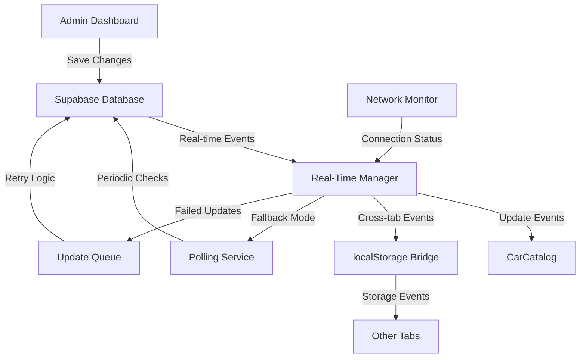
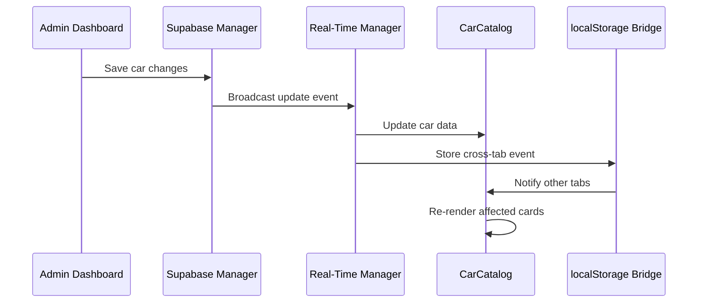

# Design Document: Nordic Autos Real-Time Update Fix

## Overview

This design addresses the critical real-time update issue where car model name changes in the admin dashboard don't immediately reflect on the lagerbiler inventory page. The solution implements a robust multi-layered approach combining Supabase real-time subscriptions, cross-tab communication, and intelligent fallback mechanisms to ensure reliable data synchronization.

The core issue stems from the current implementation having multiple refresh mechanisms that don't work cohesively. While the admin dashboard correctly dispatches events and the CarCatalog has various refresh triggers, the data flow is inconsistent and unreliable.

## Architecture

### High-Level Architecture



### Component Interaction Flow



## Components and Interfaces

### 1. Real-Time Manager (New Component)

**Purpose**: Central coordinator for all real-time updates and fallback mechanisms.

**Interface**:
```javascript
class RealTimeManager {
    // Core methods
    async initialize()
    async subscribeToCarUpdates(callback)
    async handleCarUpdate(updateData)
    
    // Fallback management
    enableFallbackMode()
    disableFallbackMode()
    
    // Cross-tab communication
    broadcastToTabs(eventData)
    handleCrossTabEvent(event)
    
    // Connection monitoring
    monitorConnection()
    handleConnectionChange(isOnline)
}
```

**Key Features**:
- Manages Supabase real-time subscriptions
- Handles fallback to polling when WebSocket fails
- Coordinates cross-tab communication via localStorage
- Implements exponential backoff for failed connections
- Provides connection status monitoring

### 2. Enhanced CarCatalog (Modified Component)

**Purpose**: Updated to work seamlessly with the Real-Time Manager.

**Key Changes**:
- Remove duplicate refresh mechanisms
- Integrate with Real-Time Manager for updates
- Implement selective card updates instead of full re-renders
- Add visual feedback for update states

**New Methods**:
```javascript
// Selective update methods
updateCarCard(carId, carData)
batchUpdateCards(updates)
showUpdateIndicator(carId)
hideUpdateIndicator(carId)

// Integration with Real-Time Manager
registerWithRealTimeManager()
handleRealTimeUpdate(updateData)
```

### 3. Update Queue Service (New Component)

**Purpose**: Manages failed updates and retry logic.

**Interface**:
```javascript
class UpdateQueueService {
    enqueueUpdate(updateData)
    processQueue()
    retryFailedUpdate(updateId)
    clearQueue()
    getQueueStatus()
}
```

**Features**:
- Queues updates when offline
- Implements exponential backoff retry
- Preserves update order
- Provides queue status for UI feedback

### 4. Cross-Tab Communication Bridge (New Component)

**Purpose**: Handles communication between browser tabs using localStorage events.

**Interface**:
```javascript
class CrossTabBridge {
    broadcast(eventType, data)
    subscribe(eventType, callback)
    unsubscribe(eventType, callback)
    generateEventId()
    handleStorageEvent(event)
}
```

**Features**:
- Uses localStorage events for cross-tab messaging
- Prevents duplicate event processing
- Handles event deduplication
- Provides reliable message delivery

## Data Models

### Update Event Model
```javascript
{
    id: string,           // Unique event ID
    type: 'car_updated' | 'car_deleted' | 'car_added',
    timestamp: number,    // Unix timestamp
    carId: string,        // Car identifier
    carData: object,      // Complete car data
    source: 'admin' | 'api' | 'sync',
    tabId: string,        // Originating tab ID
    retryCount: number    // For failed updates
}
```

### Connection Status Model
```javascript
{
    isOnline: boolean,
    supabaseConnected: boolean,
    realTimeActive: boolean,
    fallbackMode: boolean,
    lastSuccessfulSync: number,
    queuedUpdates: number
}
```

### Car Update Model
```javascript
{
    id: string,
    brand: string,
    model: string,        // Primary field for this fix
    variant?: string,
    year: number,
    price: number,
    status: 'available' | 'reserved' | 'sold',
    updated_at: string,   // ISO timestamp
    // ... other car fields
}
```

## Correctness Properties

*A property is a characteristic or behavior that should hold true across all valid executions of a system-essentially, a formal statement about what the system should do. Properties serve as the bridge between human-readable specifications and machine-verifiable correctness guarantees.*

Based on the prework analysis, the following properties ensure the real-time update system works correctly:

### Property 1: Real-Time Update Propagation
*For any* car update made in the admin dashboard, all connected lagerbiler pages should reflect the change within 2 seconds, and only the affected car cards should be updated without full page reloads.
**Validates: Requirements 1.1, 1.2, 5.2**

### Property 2: Cross-Tab Synchronization
*For any* car update in one browser tab, all other open tabs should receive and display the update within 2 seconds, maintaining consistent state across all tabs.
**Validates: Requirements 2.1, 2.2**

### Property 3: Update Ordering Consistency
*For any* set of concurrent car updates, the system should process and display them in timestamp order, ensuring data consistency across all clients.
**Validates: Requirements 1.3, 4.2**

### Property 4: Fallback Mode Activation
*For any* Supabase connection failure, the system should automatically switch to localStorage fallback and periodic polling within 10 seconds, with appropriate status indicators.
**Validates: Requirements 3.1, 3.3, 3.5**

### Property 5: Update Queue Management
*For any* network connectivity issues, the system should queue failed updates, preserve their order, and retry with exponential backoff until successful or maximum retries reached.
**Validates: Requirements 3.2, 4.5**

### Property 6: Data Synchronization After Reconnection
*For any* connectivity restoration after an outage, the system should synchronize all queued changes with the database and reconcile any data inconsistencies using the database as source of truth.
**Validates: Requirements 3.4, 4.4**

### Property 7: Update Verification and Error Handling
*For any* car update operation, the system should verify successful database writes and provide specific error messages for validation failures, with visual feedback for update status.
**Validates: Requirements 4.1, 4.3, 1.5**

### Property 8: Performance and Batching
*For any* rapid sequence of updates, the system should batch them to prevent excessive re-rendering while maintaining page load times under 3 seconds and preserving user interaction responsiveness.
**Validates: Requirements 5.1, 5.3, 5.5**

### Property 9: State Persistence
*For any* page refresh or tab visibility change, the system should maintain current filter/sort settings and check for missed updates when tabs become visible.
**Validates: Requirements 5.4, 2.5**

### Property 10: Comprehensive Logging
*For any* system operation (updates, failures, mode transitions), the system should log detailed information including timing, source, status, error details, and performance metrics.
**Validates: Requirements 6.1, 6.2, 6.3, 6.4**

### Property 11: Connection Mode Selection
*For any* system state, when Supabase real-time is available, WebSocket connections should be used; when unavailable, localStorage events should handle cross-tab communication.
**Validates: Requirements 2.3, 2.4**

### Property 12: Status Dashboard Accuracy
*For any* administrator request, the status dashboard should display current connection health, recent update activity, and queue status reflecting the actual system state.
**Validates: Requirements 6.5**

## Error Handling

### Connection Failures
- **WebSocket Disconnection**: Automatically retry connection with exponential backoff (1s, 2s, 4s, 8s, max 30s)
- **Database Unavailable**: Switch to localStorage mode and queue all updates for later synchronization
- **Network Timeout**: Implement 5-second timeout for all database operations with retry logic

### Data Consistency Errors
- **Concurrent Updates**: Use timestamp-based conflict resolution with database as source of truth
- **Stale Data Detection**: Compare local timestamps with server timestamps on each update
- **Validation Failures**: Display specific error messages and prevent invalid data propagation

### Cross-Tab Communication Failures
- **localStorage Unavailable**: Fall back to periodic polling for cross-tab sync
- **Event Deduplication**: Use unique event IDs to prevent duplicate processing
- **Tab Isolation**: Handle cases where tabs become unresponsive or crash

### User Experience During Errors
- **Visual Feedback**: Show connection status indicators (online/offline/syncing)
- **Graceful Degradation**: Allow read-only access when updates fail
- **Error Recovery**: Provide manual refresh options when automatic recovery fails

## Testing Strategy

### Dual Testing Approach
The system requires both unit tests and property-based tests for comprehensive coverage:

**Unit Tests** focus on:
- Specific error scenarios and edge cases
- Integration points between components
- Mock implementations for external dependencies
- User interface feedback mechanisms

**Property-Based Tests** focus on:
- Universal properties across all inputs and conditions
- Comprehensive coverage through randomized test data
- System behavior under various network conditions
- Data consistency across multiple concurrent operations

### Property-Based Testing Configuration
- **Testing Library**: Use fast-check for JavaScript property-based testing
- **Test Iterations**: Minimum 100 iterations per property test
- **Test Environment**: Simulate multiple browser tabs and network conditions
- **Data Generation**: Generate random car data, update sequences, and timing scenarios

### Test Categories

#### Real-Time Update Tests
- **Property Tests**: Verify update propagation timing and consistency across all scenarios
- **Unit Tests**: Test specific WebSocket connection handling and error recovery
- **Integration Tests**: End-to-end update flow from admin dashboard to inventory display

#### Cross-Tab Communication Tests
- **Property Tests**: Verify synchronization across any number of tabs with various update patterns
- **Unit Tests**: Test localStorage event handling and message deduplication
- **Performance Tests**: Measure synchronization latency under different loads

#### Fallback Mechanism Tests
- **Property Tests**: Verify fallback activation and recovery under all network conditions
- **Unit Tests**: Test specific polling intervals and queue management
- **Chaos Tests**: Simulate various failure scenarios and recovery patterns

#### Data Consistency Tests
- **Property Tests**: Verify conflict resolution and data reconciliation across all scenarios
- **Unit Tests**: Test timestamp comparison and validation logic
- **Stress Tests**: High-frequency concurrent updates with network instability

### Test Tags and Documentation
Each property test must include a comment referencing its design document property:
- **Feature: nordic-autos-realtime-fix, Property 1: Real-Time Update Propagation**
- **Feature: nordic-autos-realtime-fix, Property 2: Cross-Tab Synchronization**
- And so on for all 12 properties

### Mock and Simulation Requirements
- **Supabase Mock**: Simulate database operations, real-time subscriptions, and connection failures
- **Network Simulation**: Control network latency, packet loss, and connectivity
- **Multi-Tab Simulation**: Create multiple browser context simulations for cross-tab testing
- **Time Control**: Mock system time for testing timing-dependent behaviors